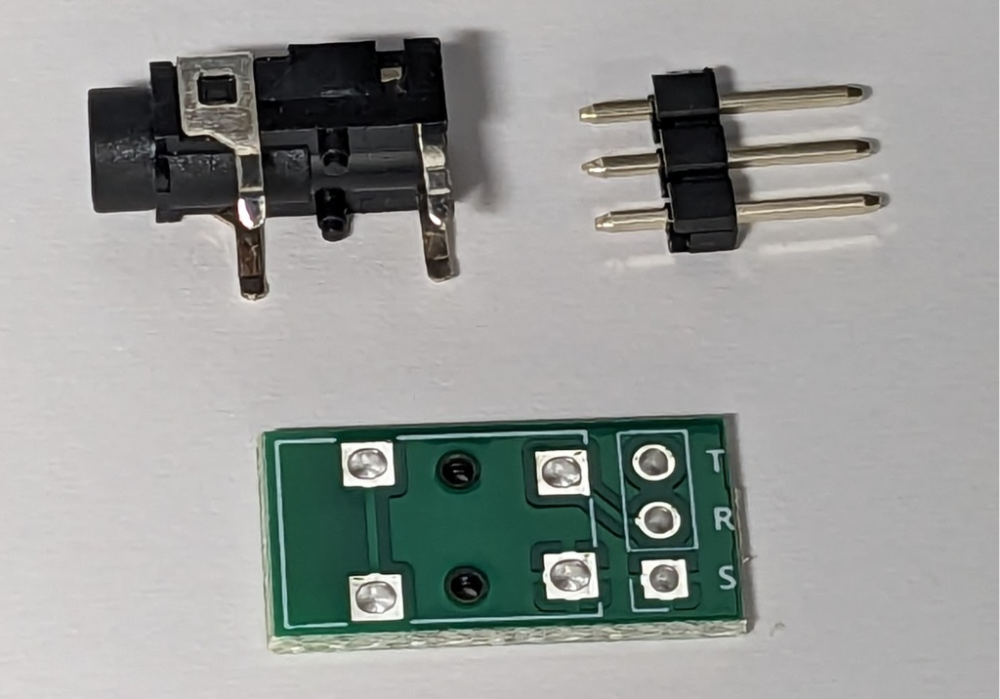
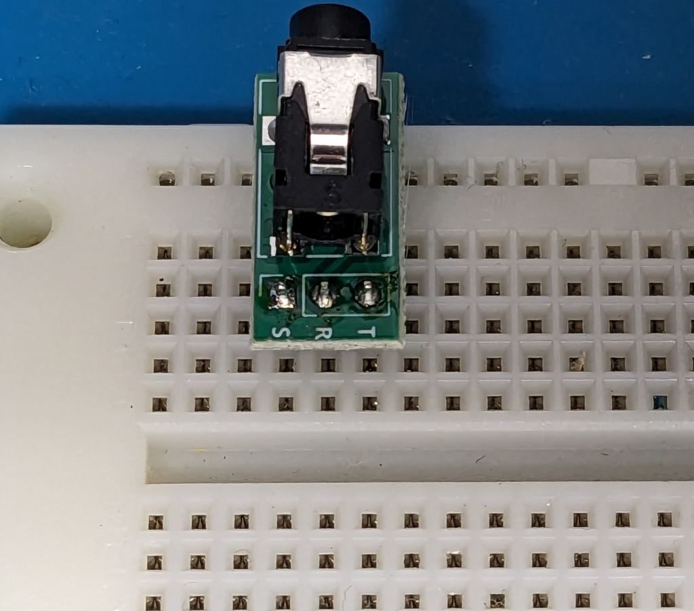

# 3.5mm TRS Jack chan

[Document in Japanese](README_ja.md)
3.5mm TRS Jack chan is a utility PCB to convert 3.5mm TRS jack to/from 2.54mm pitch.
It would be useful for breadboard prototyping, making things with universal PCB, or etc.

Especially designed not to occupy large area.

## Kit Contents

- Circuit board
- 3.5mm TRS Jack
- 1x3 pin header

## How to assemble

1. Solder 3.5mm TRS Jack and pin header.

## Application

1x3 area can solde other connectors, directions. For example you can use 1x3 pin socket, solder 1x3 pin header from top side, etc.
