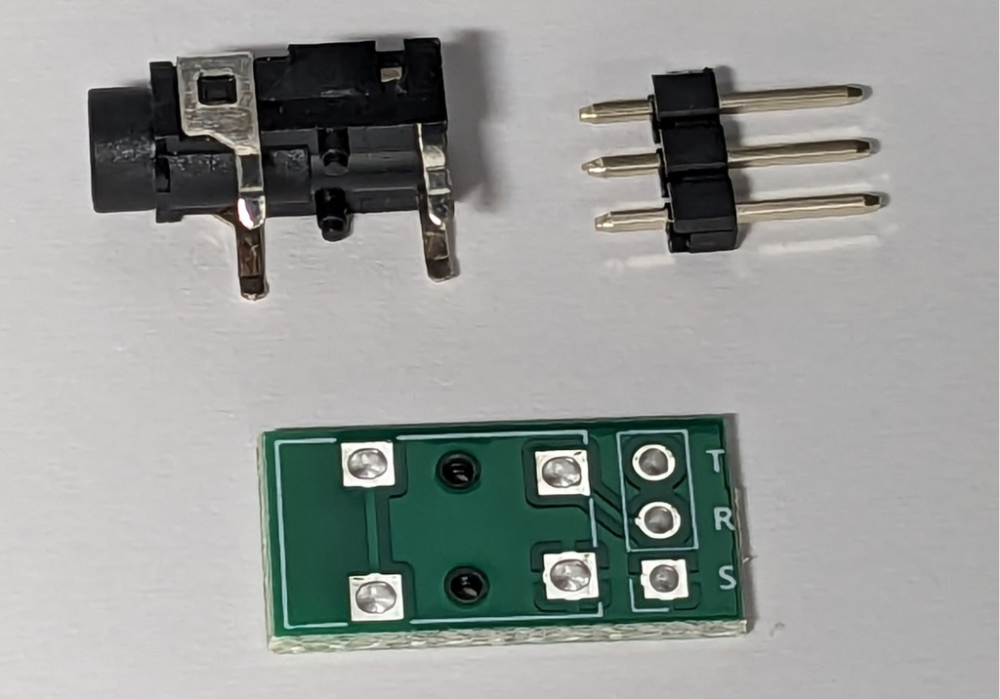
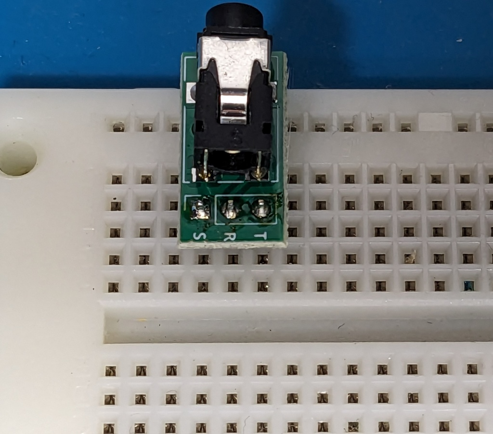

# 3.5mm TRS Jack chan

3.5mm TRSジャックちゃんは、

3.5mmのTRSジャックから、2.54mmに変換することができる基板です。

ブレッドボードやユニバーサル基板などの工作に便利です。

小型で、占有する面積が少なくなっています。

## キットの内容

- 基板
- 3.5mm TRS ジャック
- 1x3 ピンヘッダ

## 組み立て方

1. 3.5mm TRS ジャックとピンヘッダをはんだづけします。上図を参照してください。

## 応用

1x3の部分にピンソケットをつけたり、ピンヘッダを逆向きにはんだづけするなど、用途に応じてご利用ください。
